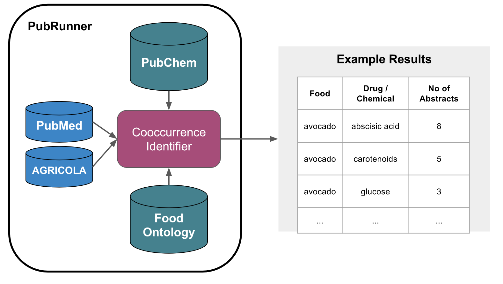

# Food Relations

This project is a demonstration of a very basic text mining approach to extract nutrigenomics data from [PubMed](https://www.ncbi.nlm.nih.gov/pubmed/) and [AGRICOLA](https://agricola.nal.usda.gov/) abstracts. It uses the [PubRunner project](https://github.com/jakelever/pubrunner) to make it easy to run the text mining tools on both corpora without having to deal with format conversions.

## How it works.

The diagram below outlines the key concepts of the project. The first stage involves the [cooccurrenceExtractor.py](https://github.com/jakelever/foodrelations/blob/master/cooccurrenceExtractor.py) script. It loads drug terms from [PubChem](https://pubchem.ncbi.nlm.nih.gov/) and a list of food items from the [Food Ontology](https://github.com/FoodOntology/foodon). It then loads each document and identifies all the drug and food terms using dictionary matching. It then outputs all the cooccurrences of these terms. This first stage is run multiple times for all the document files provided. The second stage uses the [combineCooccurrences.py](https://github.com/jakelever/foodrelations/blob/master/combineCooccurrences.py) script. It takes the output of the multiple runs of the first stage and combines them together.



## Dependencies

This project has a couple dependencies:
- [PubRunner](https://github.com/jakelever/pubrunner) (which can be installed using pip)
- [AGRICOLA](https://agricola.nal.usda.gov/) (which is not currently publicly available)

## Execution

With PubRunner installed, the test case can be run as follows

```
pubrunner --test .
```

Remove the "--test" to execute the very large full run.

## More Details

### Wordlist Data

This project relies on two data files that contain wordlists for food items and drug items. The food items file is preprocessed and stored as [food.json](https://github.com/jakelever/foodrelations/blob/master/food.json). This makes use of the [Food Ontology](https://github.com/FoodOntology/foodon) and was generated using the [extractFoodOnTerms.py](https://github.com/jakelever/foodrelations/blob/master/extractFoodOnTerms.py). The drug terms are generated using the PubChem list of chemicals associated with MeSH terms. The [generateDrugTerms.py](https://github.com/jakelever/foodrelations/blob/master/generateDrugTerms.py) is used to quickly parse this file and extract the needed terms.

### Data Processing

The two scripts [cooccurrenceExtractor.py](https://github.com/jakelever/foodrelations/blob/master/cooccurrenceExtractor.py) and [combineCooccurrences.py](https://github.com/jakelever/foodrelations/blob/master/combineCooccurrences.py) are both short and use basic Python with no external libraries. [cooccurrenceExtractor.py](https://github.com/jakelever/foodrelations/blob/master/cooccurrenceExtractor.py) loads the two wordlists (food and drugs) and starts processing a document that must be in [BioC format](http://bioc.sourceforge.net/). It makes use of the BioC python library to load the document. It then does very naive tokenization (using whitespace) and identifies all terms from the associated wordlists. It outputs every cooccurrence of food and drugs within each document. This script is executed for multiple files and hence there are many output files that need to be merged. The [combineCooccurrences.py](https://github.com/jakelever/foodrelations/blob/master/combineCooccurrences.py) script takes care of this.

### PubRunner

This project takes advantage of the [PubRunner project](https://github.com/jakelever/pubrunner) to deal with downloading corpora, format conversion and execution of the tools. The key to this is the is [pubrunner.yml](https://github.com/jakelever/foodrelations/blob/master/pubrunner.yml) which describes the resources and commands that PubRunner needs to run the project.

This file describes the two resources to be used (PUBMED and AGRICOLA). These are in different formats Pubmed XML and Marc XML respectively. The [pubrunner.yml](https://github.com/jakelever/foodrelations/blob/master/pubrunner.yml) requests that they are both converted to BioC XML format before running the associated Python scripts for this project.a

As noted above, PubRunner can be run in test mode (which uses a smaller version of the resources: AGRICOLA/PUBMED) and hence runs much more quickly. This information is also defined in the [pubrunner.yml](https://github.com/jakelever/foodrelations/blob/master/pubrunner.yml) file and used with the --test flag. 

The files in [resources/](https://github.com/jakelever/foodrelations/blob/master/resources/) define where the AGRICOLA and AGRICOLA_TWOFILES data files can be found. These aren't currently publicly available.

## Future Ideas

This is a very simple implementation to show the power of bringing different resources (PubMed, AGRICOLA, PubChem and FoodOn) together using PubRunner. Below are a few ideas to improve this:

- Improve the tokenization using Spacy
- Clean up the term files using some custom filters
- Visualisation of the resulting data


